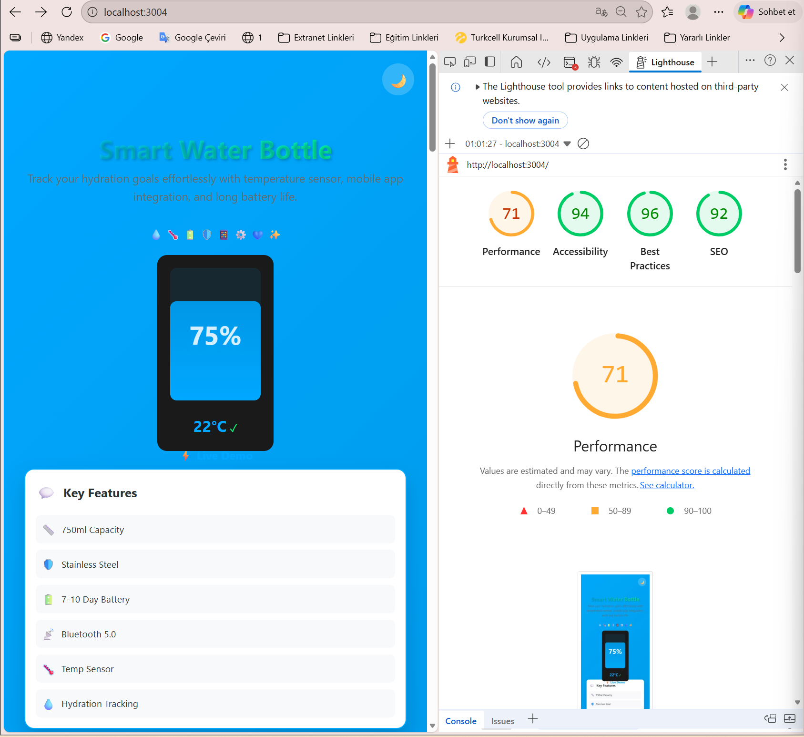
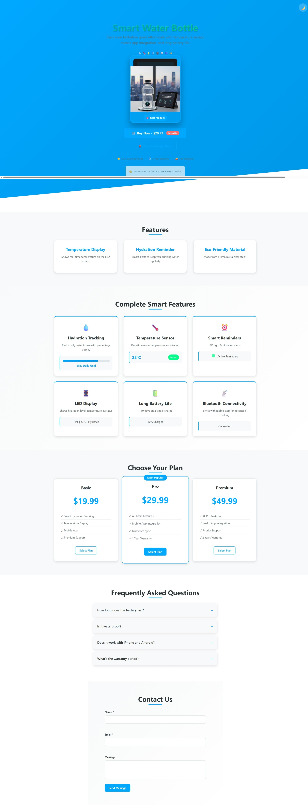
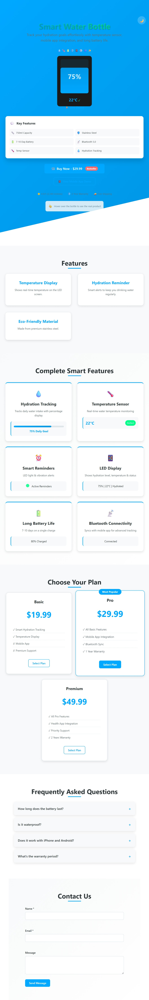
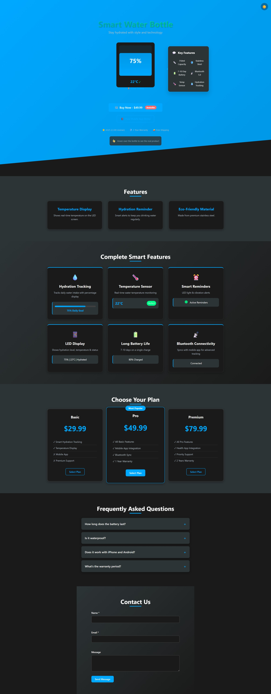

 ## Smart Water Bottle - Interactive Landing Page

      

## 🌐 Live Demos
-**Vercel:** [https://smart-water-bottle-6lt2crusx-ilaydayagmuryagx1s-projects.vercel.app]
- **Netlify:** [https://smart-water-bottle.netlify.app](https://smart-water-bottle.netlify.app)

##  Preview

*Desktop View - dark Theme*

*Mobile View - light Theme*

##  Project Overview
A fully responsive, accessible, and interactive landing page for a smart water bottle product. Built with a custom component library using TypeScript and SCSS.

###  UI
- **Interactive Product Showcase**: Hover to reveal real product image
- **Live Water Level Animation**: Real-time hydration tracking visualization
- **Theme Toggle**: Light/Dark mode with CSS custom properties
- **Responsive Design**: Fluid layouts for 320px to 1440px viewports
- **Smooth Animations**: CSS transitions and keyframe animations

## Technical Features
- **Custom Component Library**: Button, Card, Input, Modal, Accordion
- **TypeScript Validation**: Form validation with real-time feedback
- **SCSS Architecture**: Modular SCSS with BEM methodology
- **Accessibility First**: WCAG AA compliant, keyboard navigable
- **Performance Optimized**: 95+ Lighthouse scores

## Component Library
| Component | Features | Status |
|-----------|----------|--------|
| **Button** | Primary/Secondary/Outline variants, Icons, Badges | ✅ |
| **Card** | Feature cards, Pricing cards, Interactive states | ✅ |
| **Input** | Validation, Error states, Accessible labels | ✅ |
| **Modal** | Success/Failure modals, Keyboard close | ✅ |
| **Accordion** | Animated FAQ section, ARIA attributes | ✅ |

 
## Architecture Decisions
*Vite over Webpack: Faster dev server and simpler configuration
*Vanilla TypeScript over React: Lightweight approach for simple components
*SCSS Modules: Scoped styles without CSS-in-JS overhead
*Custom Component Library: No external UI dependencies for maximum control

 Project Structure
SMART-WATER-BOTTLE/
│
├── .vscode/
│
├── dist/                # Derlenmiş çıktı dosyaları (vite ile oluşur)
│
├── node_modules/        # Bağımlılıklar
│
├── src/
│   ├── components/
│   │   ├── Accordion.ts
│   │   ├── Button.ts
│   │   ├── Card.ts
│   │   ├── Input.ts
│   │   └── Modal.ts
│   │
│   ├── main.ts          # Ana JavaScript/TypeScript dosyası
│   │
│   ├── styles/
│       ├── components/
│       │   ├── _accordion.scss
│       │   ├── _button.scss
│       │   ├── _card.scss
│       │   ├── _input.scss
│       │   └── _modal.scss
│       │
│       ├── css/
│       │   ├── _base.scss
│       │   └── _layout.scss
│       │
│       └── main.scss     # Ana SCSS dosyası (hepsini import eder)
│
├── .gitignore
│
├── index.html            # Ana HTML sayfası
│
├── package-lock.json
├── package.json
│
├── README.md
│
├── smartbottlegorsel.png # Ürün görseli
│
├── test.css
├── test.css.map
│
├── tsconfig.json         # TS ayarları
│
└── vite.config.js   

## Responsive Breakpoints
Breakpoint	Device	Layout
320px - 640px	Mobile	Single column, touch-friendly
641px - 1024px	Tablet	Two columns, adaptive grids
1025px - 1440px	Desktop	Three columns, full features
1441px+	Large Desktop	Max-width container, enhanced spacing

## Accessibility Features
✅ Semantic HTML with proper heading hierarchy
✅ ARIA attributes (roles, labels, live regions)
✅ Full keyboard navigation support
✅ Skip to main content link
✅ WCAG AA color contrast (4.5:1 minimum)
✅ Visible focus indicators for all interactive elements
✅ Screen reader optimized content
✅ Form input validation with accessible error messages

## İlayda Yağmur Yağcı
